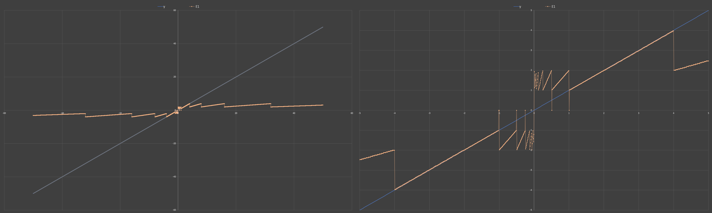
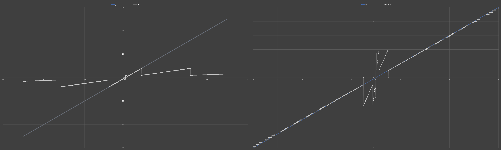
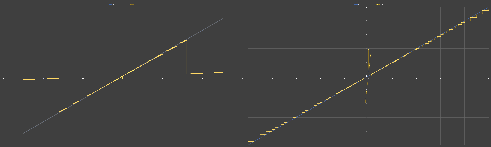
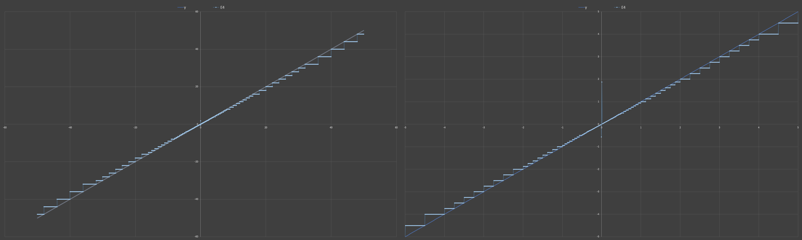
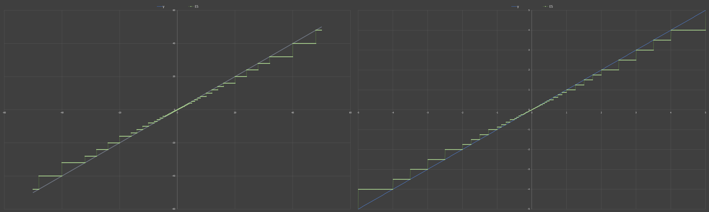

# TrueSingleFloat
A simple demo that compresses a IEEE 754 single precision floating point number down to the size of a byte

## Precision Showcases
Each of the images have a step of 0.01. 
The left is a range of -50 to +50
The right has a range of -1 to +1

| Exponent Bits |        Previews        |
| ------------- | :--------------------: |
| E=1           |  |
| E=2           |  |
| E=3           |  |
| E=4           |  |
| E=5           |  |
